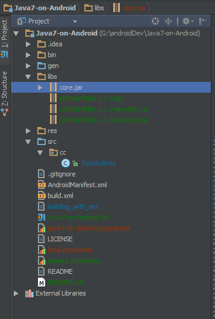

# Using Java 7 & 8 Features on Android

Feeling like you're stuck in 2006 while developing apps and libraries for Android?

Don't worry, you're not alone. However, there's a solution!

To help bring Android Java development into the modern era, I've tested and compiled a list of Java 7 and 8 features that will work on Android. Some of them, I discovered through a bit of testing and modding, while others depend on libraries maintained by others. Without further BS, here's a list of everything that can be used without issues on at least Android 2.2+.

## Possible Features

* Try with resources (auto closing file handlers)
* String switches
* Multiple exception caught in one catch block
* Integer (and binary) literals for readability
* Type inference on collections (a.k.a. "diamonds")
* [Java 8 lambdas (instructions coming soon)](https://github.com/orfjackal/retrolambda)
* [Java 7 fork-join (instructions coming soon)](http://gee.cs.oswego.edu/dl/concurrency-interest/index.html)

## Things that don't Work

* Java 7 file API (java.nio.*) because some native code needs ported
* File change notifications (watch/notify file api stuff)
* Invoke Dynamic and features that rely on it (would require modifying Dalvik to support it)

## Setting up on Intellij IDEA 13 (and probably Android Studio)

The new Intellij finally has a built in option to override core libraries of Android, making much of the above far easier. The instructions below take advantage of this and allow us to override the core libraries with a jar within Intellij IDEA normal build process. If using Intellij IDEA 12, you'll have to use the [old fallback instructions](https://github.com/yareally/Java7-on-Android/tree/master) as the directions for Intellij IDEA 13 will not work.

1. Clone this project or grab core.jar from the libs directory.
2. Enable overriding the Android core libraries by going to File → Settings → Compiler → Android Compilers

3. Ensure core.jar is in your project library directory like below:

4. Go to the File dropdown menu → Project Structure → Libraries and create a new library with core.jar:

5. While still in the project setup area from above, go to "Modules" and add the newly created library as a project dependency. Ensure that it is placed above the Android SDK so that it overrides the Android SDK when necessary.

6. Under the SDKs settings in the Platform Settings area, ensure you have an Android SDK set up to use at least Java 7 (Java 8 if you wish to use lambdas). Java 8 and Android are a bit quirky together in Intellij, so you may experience issues getting the Java 8 SDK to stick.

7. The final setting to change under the project settings area is under "Project." Change the project language level to 7.0 (8.0 if you are going to use lambdas).

8. Run this project's Android TestActivity to ensure everything is set up properly. If it does not run or you see syntax errors in Intellij, then ensure you settings looks similar to my screen shots.